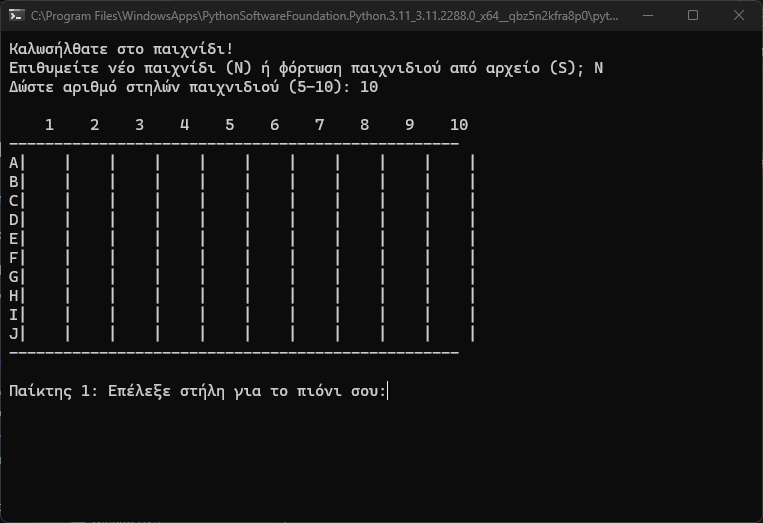

# Tic-Tac-Toe

A Tic-Tac-Toe like game made in python, able to run in command line.


## Game Rules:

- The objective of the game is to form as many quadruples as possible with the pawns of each player.

- A round is completed when one of the two players forms a quadruple with their pawns either horizontally, vertically, or diagonally.

- Upon forming a quadruple by any player, a point is added to the score of that specific player, and that player is declared the winner of the round.

- The game ends when, after a player's win and the completion of a round, the players choose not to play another round, or when during a round the board is filled.

- Upon the game's completion, the final score (the number of wins of each player) and the winner (the player with the most wins) are displayed.

- If at the same time there are more than 4 pawns of a player in the same direction (horizontal, vertical, diagonal), then only 4 pawns are removed, and the player earns 1 point (one win).

- When the pawns of the winning quadruple are removed, and the pawns of each column move one position down, any other quadruple formed with the pawns of the 1st or 2nd player adds one win to the score of the corresponding player.

- When the players choose to save the game's state in a file, any name is accepted for the file name (without the file type, e.g., 'name1' and not 'name1.txt' or 'name1.csv').


## Installation

1. Download the project directories
2. Ensure python 3 is installed
3. Run tic-tac-toe-game.py file 

```bash
  python tic-tac-toe-game.py
```

## Screenshots




