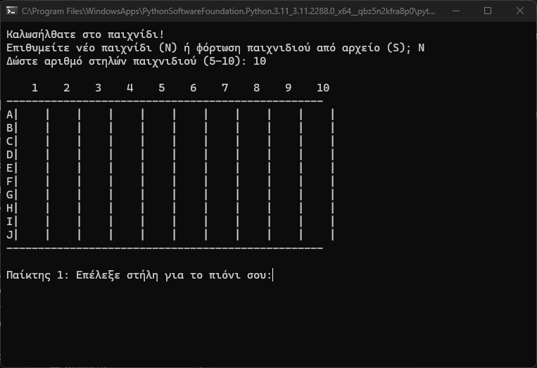

# Python tic-tac-toe CLI Game

**Κανόνες του παιχνιδιού:**

	- Σκοπός του παιχνιδιού είναι ο σχηματισμός όσο περισσότερων τετράδων από τα πιόνια του κάθε παίκτη.

	- Ένας γύρος ολοκληρώνεται όταν κάποιος από τους δύο παίκτες σχηματίσει με τα πιόνια του μία τετράδα οριζόντια, κάθετα ή 	διαγώνια.

	- Με τον σχηματισμό τετράδας από οποιονδήποτε παίκτη, προστίθεται ένας πόντος στις νίκες του συγκεκριμένου παίκτη και 	χαρακτηρίζεται νικητής του γύρου.

	- Το παιχνίδι ολοκληρώνεται όταν μετά από τη νίκη ενός παίκτη και την ολοκλήρωση του γύρου, οι παίκτες επιλέγουν αν δεν 	θέλουν να παίξουν κι άλλο γύρο, ή όταν κατά τη διάρκεια ενός γύρου το ταμπλό γεμίσει.

	- Όταν το παιχνίδι τελειώσει, εμφανίζεται το τελικό σκορ (ο αριθμός νικών του κάθε παίκτη) και ο νικητής (ο παίκτης με τους 	περισσότερους νικημένους γύρους).

**Διευκρινίσεις:**

        - Αν την ίδια στιγμή υπάρχουν περισσότερα από 4 πιόνια ενός παίκτη στην ίδια διεύθυνση (οριζόντια, κάθετα, διαγώνια) τότε 	αφαιρούνται μόνο 4 πιόνια, και ο παίκτης παίρνει 1 πόντο (μία νίκη δηλαδή).

        - Όταν αφαιρεθούν τα πιόνια της νικήτριας τετράδας, και τα πιόνια της κάθε στήλης πέσουν μια θέση προς τα κάτω, οποιαδήποτε 	άλλη τετράδα δημιουργείται με τα πιόνια του 1ου ή του 2ου παίκτη, προστίθεται μία νίκη στο σκορ του αντίστοιχου παίκτη.

        - Όταν οι παίκτες επιλέξουν να αποθηκεύσουν την κατάσταση του παιχνιδιού σε ένα αρχείο, σαν όνομα του αρχείου είναι 	αποδεκτό οποιοδήποτε όνομα (χωρίς τον τύπο του αρχείου, π.χ. 'όνομα1' και όχι 'όνομα1.txt' ή 'όνομα1.csv').

